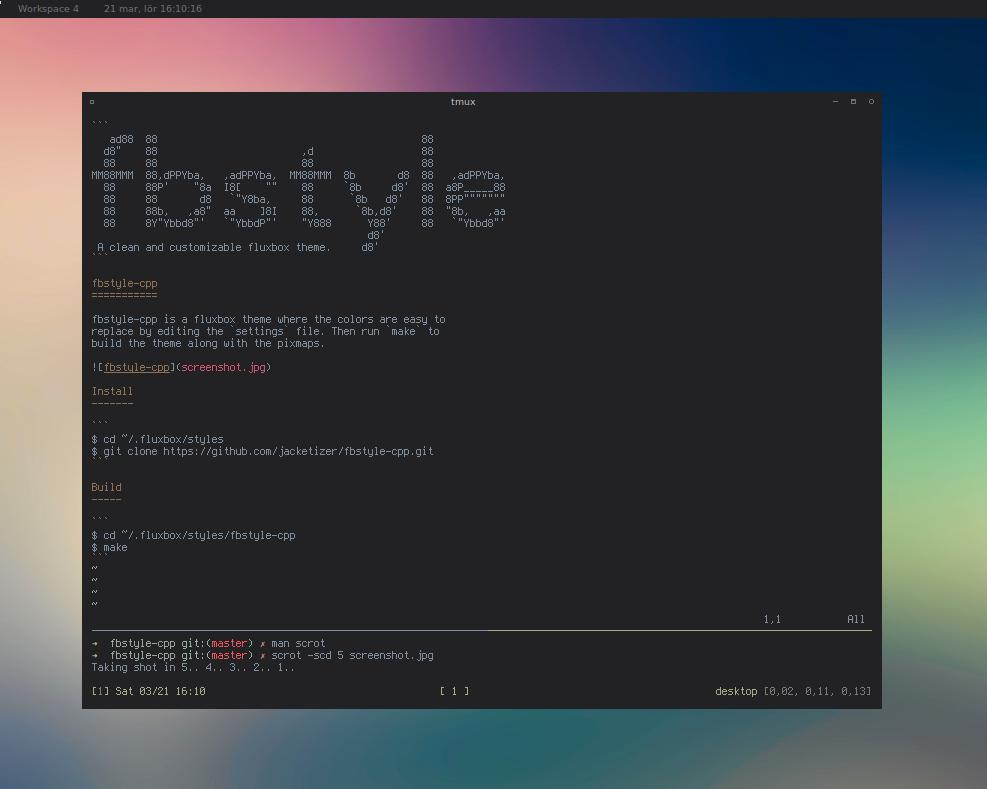

```
   ad88  88                                            88
  d8"    88                        ,d                  88
  88     88                        88                  88
MM88MMM  88,dPPYba,   ,adPPYba,  MM88MMM  8b       d8  88   ,adPPYba,
  88     88P'    "8a  I8[    ""    88     `8b     d8'  88  a8P_____88
  88     88       d8   `"Y8ba,     88      `8b   d8'   88  8PP"""""""
  88     88b,   ,a8"  aa    ]8I    88,      `8b,d8'    88  "8b,   ,aa
  88     8Y"Ybbd8"'   `"YbbdP"'    "Y888      Y88'     88   `"Ybbd8"'
                                              d8'
 A clean and customizable fluxbox theme.     d8'
```

fbstyle-cpp
===========

fbstyle-cpp is a fluxbox style (theme) where the colors are easy to
replace by editing the `settings` file. Then run `make` to
build the theme along with the pixmaps. The C preprocessor is
utilized to get the ability to use variables.



Install
-------

```
$ cd ~/.fluxbox/styles
$ git clone https://github.com/jacketizer/fbstyle-cpp.git
```

Build
-----

```
$ cd ~/.fluxbox/styles/fbstyle-cpp
$ make
```
